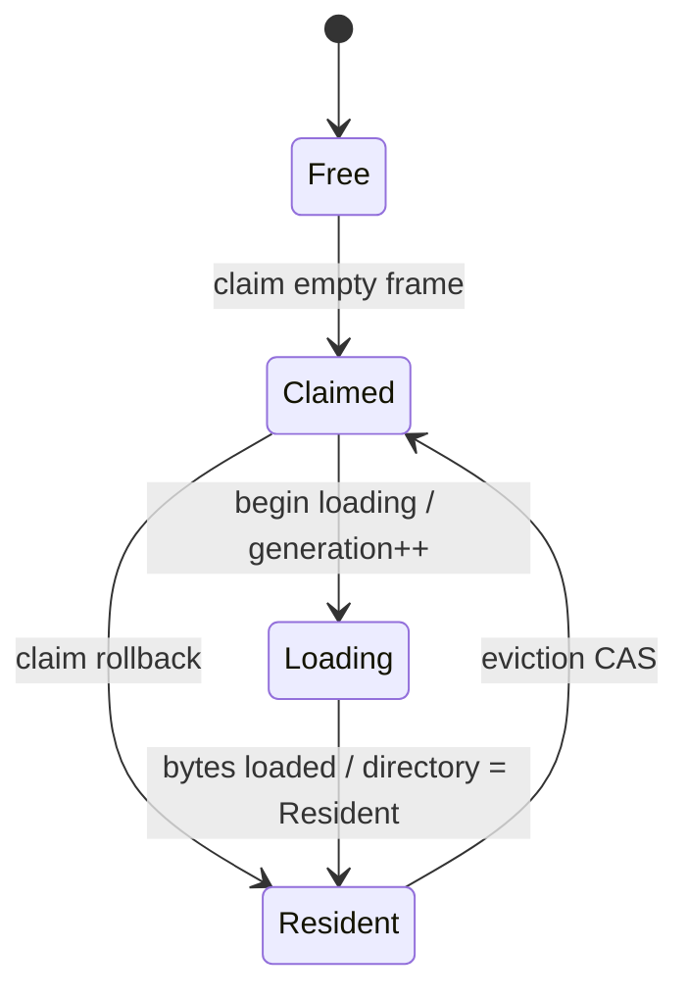
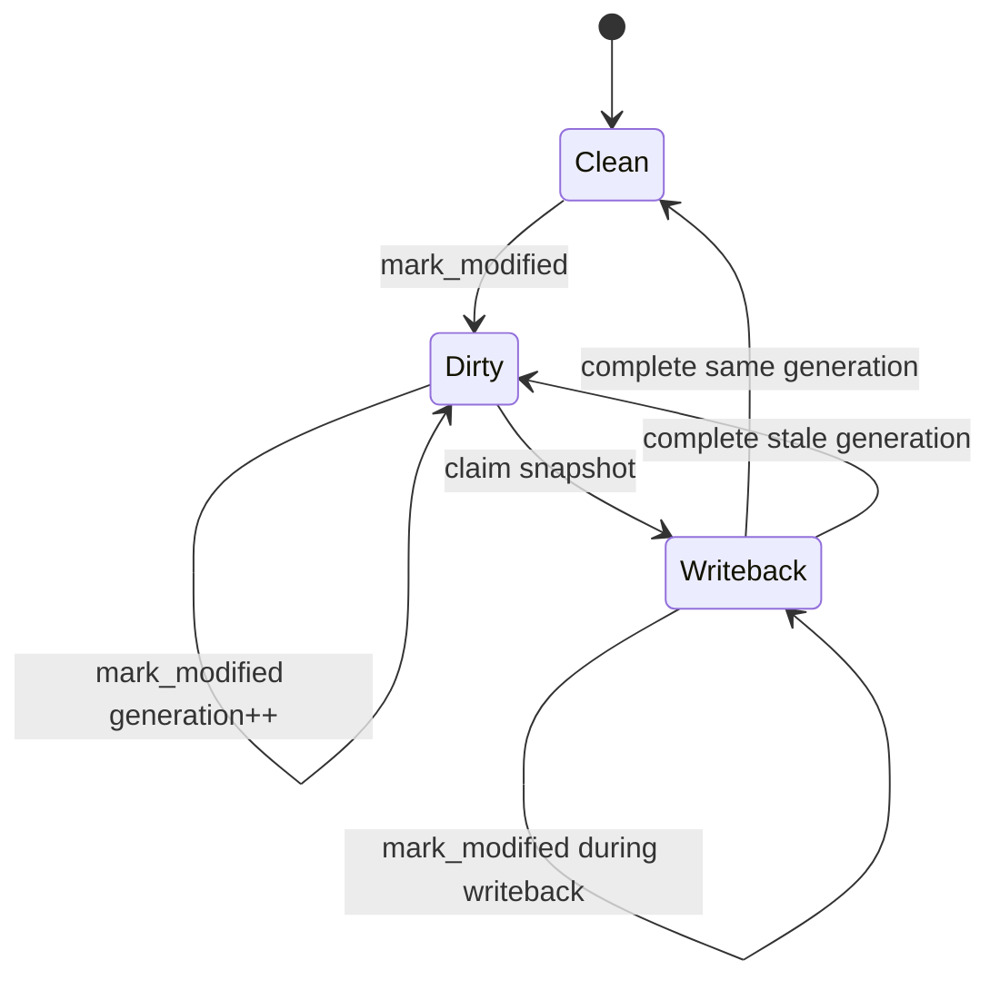

# Buffer Manager

This document describes how the current buffer manager implementation works:
what state it stores, how pin / eviction / writeback interact, and which
invariants lower layers rely on.

## Component Interaction

```text
┌──────────────────────────────────────────────────────────────────────────────┐
│                                BufferManager                                 │
│                         orchestrates transitions                             │
│                                                                              │
│   block lookup / publish / remove                                            │
│   ┌──────────────────────┐                                                   │
│   │ ShardedDirectory     │                                                   │
│   │ BlockId -> frame_idx │                                                   │
│   └──────────┬───────────┘                                                   │
│              │ resident hit gives candidate                                  │
│              ▼                                                               │
│   ┌──────────────────────────────────────────────────────────────────────┐   │
│   │ BufferFrame                                                          │   │
│   │                                                                      │   │
│   │  ┌──────────────────────┐          ┌──────────────────────────────┐  │   │
│   │  │ Hot atomics          │ fallback │ FrameMeta                    │  │   │
│   │  │                      ├─────────►│                              │  │   │
│   │  │ resident validation  │          │ dirty / writeback / cold     │  │   │
│   │  │ pin_count            │          │ frame state                  │  │   │
│   │  │ clean fast state     │◄─────────┤ publishes clean fast state   │  │   │
│   │  └──────────┬───────────┘          └──────────────┬───────────────┘  │   │
│   └─────────────┼─────────────────────────────────────┼──────────────────┘   │
│                                                                              │
│                 │ hit / assignment                    │ dirty frame becomes  │
│                 │ notifications                       │ flush candidate      │
│                 ▼                                     ▼                      │
│   ┌──────────────────────┐      ┌──────────────────────────────┐             │
│   │ PolicyState          │      │ Flush State                  │             │
│   │ records hits         │      │ dirty queue                  │             │
│   │ chooses victims      │      │ background flusher           │             │
│   └──────────┬───────────┘      └──────────────┬───────────────┘             │
│              │ victim candidate                │ clean completion            │
│              ▼                                 │ updates metadata            │
│   ┌──────────────────────┐                     │                             │
│   │ BufferFrame victim   │◄────────────────────┘                             │
│   └──────────┬───────────┘                                                   │
│              │ availability changes                                          │
│              ▼                                                               │
│   ┌──────────────────────┐                                                   │
│   │ Availability         │                                                   │
│   │ reusable frame count │                                                   │
│   │ pin waiter wakeups   │                                                   │
│   └──────────────────────┘                                                   │
│                                                                              │
└──────────────────────────────────────────────────────────────────────────────┘
```

## Core Structures

### `BufferManager`

`BufferManager` is the owner of the subsystem. It holds:

- the fixed-size `buffer_pool`
- the file and log manager handles
- availability counters
- a sharded block-to-frame directory
- replacement policy state
- dirty-page queue and background flush coordination state

Operationally, it is the place where page residency, replacement, and writeback policy meet.

### `BufferFrame`

Each frame contains:

- the resident page bytes
- frame metadata
- hot atomic pin / residency-control state
- handles needed for single-frame read / write / flush operations

#### Atomic Residency Control

Each `BufferFrame` has a packed atomic residency-control word:

- bit 0: loading
- bit 1: evicting
- bits 2 and above: residency generation

Resident pins validate this word against the directory generation before and after incrementing the
atomic pin count. That double-check is the frame-local OCC step that prevents stale directory
observations from pinning a frame that is being loaded or reused.

#### Fast Frame State

Each frame also has a conservative atomic clean/needs-meta summary.

This is not the source of truth for dirty/writeback state. `FrameMeta` remains authoritative. The
summary only answers whether ordinary clean `0 -> 1 -> 0` pin/unpin accounting can skip the metadata
mutex. Dirty, writeback, loading, or uncertain states force the path back through `FrameMeta`.

### `FrameMeta`

`FrameMeta` is the shared protocol state for one frame.

The current shape is explicit:

- residency state: free vs resident block
- flush/writeback state
- replacement-policy metadata
- stable frame index for queue/policy bookkeeping

### Sharded Directory

`ShardedDirectory` maps:

```rust
BlockId -> DirectoryEntry
```

where entries are either:

- `Installing`
- `Resident { frame_idx, generation }`

The directory has fixed independent shards, each protected by a `Mutex<HashMap<...>>`. Directory
entries are advisory: a resident lookup becomes real only after the target frame validates the
generation and transient loading/evicting bits. This lets disjoint resident hits avoid a single
global directory mutex without reintroducing per-block latches.

### Replacement Policy Boundary

Replacement policy is abstracted behind `PolicyState`.

The buffer manager delegates:

- hit recording
- assignment notifications
- victim selection

The buffer manager still decides whether a frame is actually eligible to be reused.

## Residency Protocol

Residency is split between cold identity state and hot validation state.

Cold state lives under `Mutex<FrameMeta>`:

- `FrameMeta::residency`
- current resident `BlockId`, if any

Hot state lives directly on `BufferFrame`:

- `AtomicFrameControl::generation`
- `AtomicFrameControl::loading`
- `AtomicFrameControl::evicting`
- `pin_count`

The directory points to a frame index and generation. A resident hit can use the
hot state to validate that the directory observation is still current without
taking the metadata mutex. Install and eviction paths coordinate the hot and cold
state when a frame changes identity.

Resident hits treat directory entries as hints: they validate frame generation
and loading/evicting bits, increment `pin_count`, then validate again. Failed
validation rolls the pin back. Misses reserve `Installing` before claiming a
victim, and publication happens only after page bytes and metadata are ready.
Directory removal is generation-checked so a stale eviction path cannot erase a
newer resident mapping.



`Claimed` is the transient non-pinnable state represented by the `evicting` bit.
For a free frame it means reserved for install; for a resident frame it means
claimed for reuse. Eviction sets this bit before checking colder constraints
under `FrameMeta` so new resident pins fail validation while reuse is being
decided.

### Fast Pin Path

The fast pin API exists for B-tree latch-crabbing and restart-oriented traversal.

Its contract is intentionally narrow:

- only succeeds for already-resident pages
- never waits on internal locks
- distinguishes:
  - ready
  - not resident
  - contended

That lets upper layers restart instead of introducing new waits in sensitive traversal paths.

The distinction between `not resident` and `contended` is part of the contract: callers slow-pin
real misses outside latch scope, but restart immediately when an internal directory, frame, or policy
lock would block.

## Flush Protocol

Flush state lives in `FrameMeta::flush` behind the metadata mutex. It is not the
same protocol as residency: residency says which block the frame represents,
while flush state says whether the current page image requires WAL-ordered
writeback.



The protocols are separate axes, but not arbitrary combinations. Dirty and
writeback states only make sense for a resident page image. The shared
`FrameMeta` mutex lets install, eviction, dirtying, and writeback reconcile the
two protocols when they interact.

`mark_modified` always forces `AtomicFrameFastState` to `NeedsMeta` before
updating dirty/writeback state, so future pin/unpin accounting cannot use the
clean fast path until the metadata protocol publishes clean state again.

### Generations

Each dirty page image has a generation. Dirtying an already-dirty frame keeps it
in `Dirty`, but advances the generation and updates the governing txn/LSN.

Generations solve stale completion:

- generation `g` may be claimed and written out
- the resident page may be dirtied again to generation `g+1` before completion
- completion for `g` must not clear the newer dirty state

So completion is generation-based:

- if the completed generation still matches the resident dirty generation, the frame becomes clean
- otherwise the writeback state is cleared but the frame remains dirty and may be requeued

### Snapshot-First Writeback

One flushable dirty generation is written with a stable page snapshot:

1. take `meta -> page`
2. claim the current dirty generation for writeback
3. stamp page-header LSN and recompute page CRC
4. copy page bytes into an owned aligned snapshot buffer
5. release the page lock
6. flush WAL up to the required LSN
7. write the snapshot to disk
8. reconcile completion against current frame generation

The page lock is not held across kernel I/O waits.

### Dirty Queue and Background Flusher

Dirty frames become queue candidates once they are flushable.

The background flusher is pressure-driven:

- it watches a dirty queue
- it wakes on enqueue, timeout, or shutdown
- it precleans pages when the count of clean unpinned frames falls below a target

This reduces the chance that foreground misses must pay the full dirty-eviction
cost synchronously.

### Synchronous Forced Flush

`flush_all(txn)` is still used for rollback and recovery paths.

That path reuses the same flush protocol:

- claim snapshots for the target transaction's dirty generations
- flush batches with WAL-before-data ordering
- reconcile completion back into frame state

Normal commit is WAL-only; rollback/recovery still explicitly force data-page
durability where required.

## Availability Accounting

The buffer manager tracks two related but distinct notions:

- `num_available`: frames whose pin count is zero
- `clean_unpinned`: frames that are both unpinned and clean enough to count as immediate eviction slack

The second number exists because “available” is not the same as “cheap to reuse”.

A dirty unpinned frame may be technically available, but reusing it still requires writeback work.
Non-final unpins stop at the atomic decrement. Final clean unpins can use
`AtomicFrameFastState`; dirty or uncertain final unpins reconcile through
`FrameMeta`.

## Invariants

The main buffer-manager invariants are:

1. Lock order is `meta -> page` on flush/writeback coordination paths.
2. WAL must be durable before page bytes for the governing page LSN reach disk.
3. At most one writeback generation is in flight for a frame at a time.
4. Writeback completion must not clear newer dirty state.
5. Replacement must not reuse pinned frames.
6. Replacement should treat writeback-in-progress frames as ineligible victims.
7. Directory `Resident` entries are not proof of residency until the frame generation and transient flags validate.
8. `Installing` entries must either publish a resident generation or be cleared by the owner that abandoned install.
9. The fast clean summary may be conservative, but it must never report clean while dirty/writeback accounting requires `FrameMeta`.

## Tradeoffs

1. The state machine is more explicit and safer, but more complex than a simple dirty bit plus pin count.
2. Snapshot-first writeback pays one memcpy per flushed page.
3. Background precleaning reduces foreground writeback cost, but adds coordination state and pacing policy.
4. The buffer manager now carries more architectural weight because no-force durability pushes more responsibility onto flush and recovery boundaries.

## Relationship To Other Docs

- [docs/architecture/WAL.md](./WAL.md) explains durability, recovery, and WAL ordering.
- [docs/architecture/transaction_runtime.md](./transaction_runtime.md) explains transaction authority and why write lifecycle control is explicit.
- [docs/decisions/006-snapshot-writeback-protocol.md](../decisions/006-snapshot-writeback-protocol.md) records why snapshot-first writeback was chosen over the main alternative.
