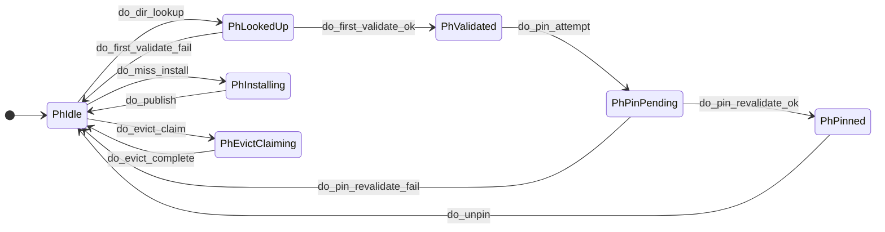
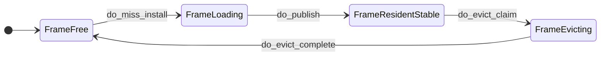
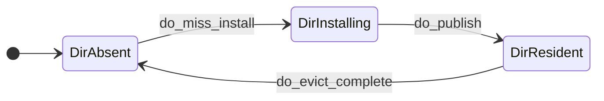

# Buffer Pool Quint State Graphs

This document collects the state-transition graphs for the Quint buffer-pool model in [specs/buffer_pool.qnt](/home/ci/worktree-buffer-pool-opt/specs/buffer_pool.qnt:42).

## Thread Phases

This graph covers all `ThreadPhase` states and the actions that transition between them in [specs/buffer_pool.qnt](/home/ci/worktree-buffer-pool-opt/specs/buffer_pool.qnt:82).

Notes:

- This is only the `thread_phase` graph. It does not show `frame_state` or `dir` transitions.
- An edge means "this action may move a thread between these phases when its guards hold."
- If an action's guards do not hold, that action is simply not enabled; there is no separate failure state.

## Frame States

This graph covers all `FrameState` values and the actions that transition between them in [specs/buffer_pool.qnt](/home/ci/worktree-buffer-pool-opt/specs/buffer_pool.qnt:65).

Notes:

- This is only the `frame_state` graph. It does not show `thread_phase` or directory transitions.
- `do_dir_lookup`, `do_first_validate_*`, `do_pin_attempt`, `do_pin_revalidate_*`, and `do_unpin` do not change `frame_state`.
- The design doc discusses a future `Writeback` state, but this first Quint model does not include it.

## Directory States

This graph covers all `DirState` values and the actions that transition between them in [specs/buffer_pool.qnt](/home/ci/worktree-buffer-pool-opt/specs/buffer_pool.qnt:55).

Notes:

- This is only the directory-state graph. It does not show `thread_phase` or `frame_state` transitions.
- The `DirResident` node stands for `DirResident { frame, gen }`.
- `do_dir_lookup` reads the directory but does not change directory state.
